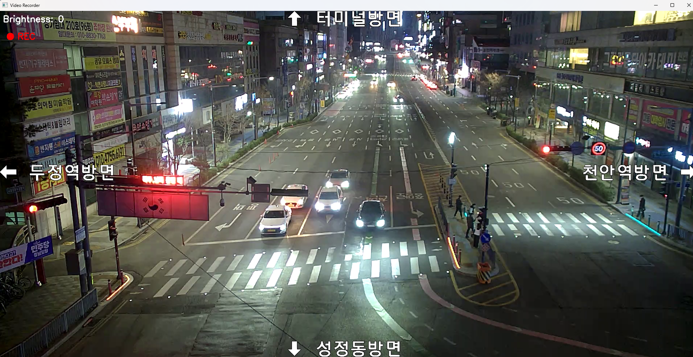

# Simple_video_record (OpenCV 영상 녹화 프로그램)

OpenCV를 이용하여 영상 스트림을 화면에 표시하고, 동영상을 녹화할 수 있는 간단한 Video Recorder 프로그램입니다.

## 프로그램 설명

이 프로그램은 OpenCV의 `VideoCapture`를 이용하여 영상 스트림을 받아 화면에 표시하고,  
`VideoWriter`를 이용하여 영상을 파일로 저장하는 기능을 제공합니다.

Preview 모드와 Record 모드를 지원하며, 키보드를 이용하여 녹화를 시작하거나 종료할 수 있습니다.

또한 추가 기능으로 **밝기 조절 기능**을 구현하였습니다.

---

## 주요 기능

### 1. 영상 화면 출력
OpenCV의 `VideoCapture`를 이용하여 영상 스트림을 받아 화면에 표시합니다.

### 2. 동영상 녹화
`VideoWriter`를 사용하여 화면에 표시되는 영상을 동영상 파일로 저장합니다.

### 3. Preview / Record 모드
- 기본 상태는 Preview 모드입니다.
- Space 키를 누르면 Record 모드로 전환됩니다.
- Record 모드에서는 화면에 **REC 표시와 빨간 점**이 나타납니다.

### 4. 프로그램 종료
ESC 키를 누르면 프로그램이 종료됩니다.

### 5. 추가 기능: 밝기 조절
영상의 밝기를 키보드로 조절할 수 있습니다.

---

## 키보드 조작

| 키 | 기능 |
|---|---|
| SPACE | 녹화 시작 / 종료 |
| U | 밝기 증가 |
| D | 밝기 감소 |
| R | 밝기 초기화 |
| ESC | 프로그램 종료 |

---

### 녹화 화면

### 녹화 영상
)
